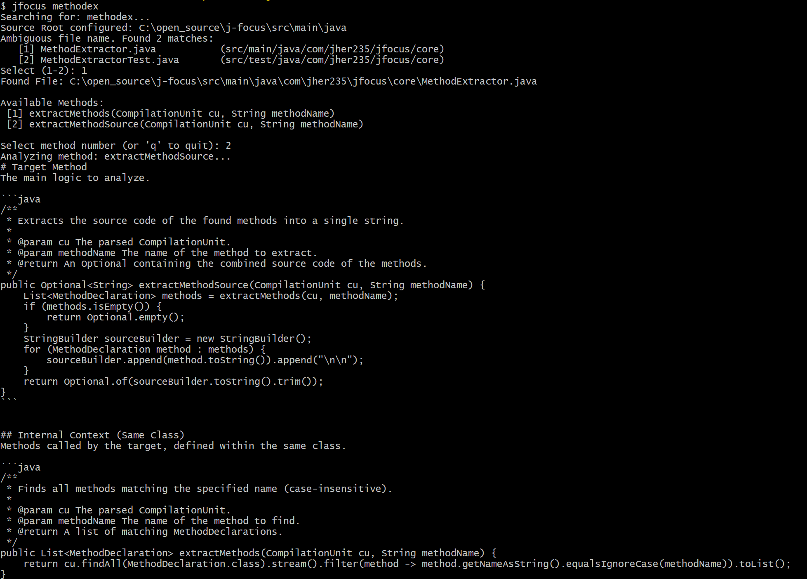

# JFocus 🔍

[](https://openjdk.org/projects/jdk/21/)
[](https://gradle.org/)
[](https://opensource.org/licenses/MIT)

[🇺🇸 **English**](README.md) | [🇰🇷 **Korean(한국어)**](README.ko.md)

> **"Stop pasting entire files into AI. All you need is context."**
>
> JFocus is a CLI tool that **intelligently extracts only the necessary code** from massive Java projects, providing **optimal prompts** for LLMs like ChatGPT or Claude.

---

## 📝 Table of Contents

- [Introduction](#introduction)
- [Benchmarks](#benchmarks)
- [Features](#features)
- [Installation](#installation)
- [Usage](#usage)
- [For AI Agents](#for-ai-agents-cursor-windsurf)
- [Contributing](#contributing)
- [License](#license)

---

## 💡 Introduction


When developing or analyzing large-scale Java projects, copy-pasting entire files to help LLMs understand code is inefficient. It hits token limits and degrades response quality with unnecessary noise.

**JFocus** solves this problem. When you select a specific method to analyze, it extracts only the **essential context (variables, called methods, class structures, etc.)** that the method depends on, formatted in Markdown.

### 🎯 Use Cases

- **Focused Analysis**: When an entire file is too large, but a single method provides insufficient context.
- **Legacy Code Navigation**: When you need to extract logic related to your changes from a 500+ line God Class.
- **Complex Dependencies**: When you need to visualize internal/external call relationships like `this.validate()` or `service.process()` at a glance.
- **LLM-Assisted Refactoring**: When you want to tell AI, "Focus only on things related to this method and advise me."

### 🚫 Non-Goals

- **No Runtime Analysis**: Does not track runtime data flow, reflection, or AOP.
- **No External Library Analysis**: Analyzes only source code (.java) within the project. Does not inspect Spring Bean graphs or JAR internals.
- **Not an IDE Replacement**: IDEs are far superior for full project navigation. JFocus focuses solely on **"Prompt Generation"**.

### 🛡️ Why AST instead of Regex?

"Can't I just use `grep`?"

Text-based searches fail to distinguish method overloading, inner classes, or methods with identical names, risking the injection of **Hallucinated Context** into the LLM.

**JFocus** uses JavaParser to convert code into an **Abstract Syntax Tree (AST)** for analysis.
- **Precise Reference Tracking**: Uses **Symbol Resolution** to track the exact target a symbol points to, rather than just matching strings.
- **Noise Reduction**: excludes comments, imports, and other unnecessary tokens to focus purely on logic.

---

## 📊 Benchmarks

`jfocus` drastically optimizes context usage for LLM agents. By extracting only the target method's logic and the signatures of referenced dependencies, it minimizes token consumption while maintaining sufficient context for code understanding.

**Test Environment:**
- **Target:** Production-level Java Spring Boot Project
- **Metric:** Character count comparison (Raw File vs. `jfocus` Output)

| Component Type | File Name | Raw Size (Chars) | jfocus Output (Chars) | **Reduction Rate** |
| :--- | :--- | :--- | :--- | :--- |
| **Controller** | `Controller.java` | 11,705 | ~2,400 | **🔻 79.5%** |
| **Logic (Mid)** | `Service.java` | 4,913 | ~2,400 | **🔻 51.1%** |
| **Logic (Small)** | `SimpleService.java` | 2,304 | ~2,014 | **🔻 12.6%** |
| **Entity** | `Entity.java` | 1,728 | ~225 | **🔻 87.0%** |

> **Key Findings:**
> - **Massive Reduction in Large Files:** Reduces size by **up to 80%** in complex controllers or service classes, allowing you to process 5x more files within the same context window.
> - **Rich Context for Small Files:** Even for small files with lower reduction rates (12%), it provides **Dependency Signatures** that are absent in the raw file, offering richer information to the agent.
>
> *Measurement: GPT-4o Tokenizer (approximate). Actual token count may vary depending on the model and tokenizer.*
>
> **💡 Qualitative Result:**
> In practical usage, LLM responses became much more **Focused**, and **Hallucinations** referencing unrelated methods were significantly reduced.

### 🚀 Scalability

> "Does it work on monorepos with thousands of classes?"

Yes, it is supported, but it is optimized for **Single Module** or **Monolithic** structures.

- **✅ Single Module**: Fully supports symbol tracking and dependency analysis.
- **⚠️ Multi-Module**: Supports multi-module projects, but ensures **optimal accuracy when class names are unique** across modules. (It uses fuzzy file matching for cross-module classes.)


---

## ✨ Features

- **🎯 Precise Context Extraction**: 
  - Determines **direct relevance** and provides core information without recursively analyzing methods called within methods, field variables, or inheritance structures.
  - (Deep Dive option for in-depth analysis is planned.)
  
- **🖥️ Interactive CLI**:
  - No need to type complex paths; just enter the filename to list and select methods within that file.

- **📋 Auto-Clipboard**:
  - Use `-c` or `--copy` option to save the extracted result immediately to the clipboard for instant pasting into LLM chat.

- **🧩 Reference Code Inclusion**:
  - Use `-v` or `--verbose` option to include the implementation code of methods **Directly Referenced** by the method being analyzed.
  - (Limited to project source code; does not unconditionally expand deep dependency chains.)

---

## 📦 Installation

### Prerequisites

To run JFocus, **Java 21 or higher** is required.

```bash
java -version  # Check if Java 21+
```

> If Java is not installed: Download [Oracle JDK](https://www.oracle.com/java/technologies/downloads/) or [OpenJDK](https://openjdk.org/).

---

### Automatic Installation (Recommended)

The installation script handles the following automatically:
1. ✅ Download latest built JAR from GitHub Releases
2. ✅ Verify file integrity with SHA256 checksum
3. ✅ Install to `~/.jfocus/` directory
4. ✅ Create execution script

#### macOS / Linux (One-Line Install)

Automatically registers Alias for `jfocus` command along with installation.

```bash
# ⚠️ Review the install script before piping to bash if you have security concerns.
curl -sL https://raw.githubusercontent.com/jher235/j-focus/main/scripts/install.sh | bash
```

#### Windows (PowerShell)

This script can be executed without administrator privileges. Automatically sets environment variables (PATH) after installation.

```powershell
iwr -useb https://raw.githubusercontent.com/jher235/j-focus/main/scripts/install.ps1 | iex
```

---

### Verification

```bash
jfocus --version
# Output: JFocus v1.0.0
```

---

<details>
<summary>📂 Manual Installation</summary>

If you cannot use the auto-script or prefer to install manually:

1. **Download JAR:**
   - Download `jfocus-1.0.0-all.jar` from [Releases Page](https://github.com/jher235/j-focus/releases)

2. **Install:**
   ```bash
   mkdir -p ~/.jfocus
   mv j-focus-1.0.0-all.jar ~/.jfocus/j-focus.jar
   ```

3. **Set Alias (Linux/macOS):**
   ```bash
   echo "alias jfocus='java -jar ~/.jfocus/j-focus.jar'" >> ~/.zshrc
   source ~/.zshrc
   ```

4. **Windows:**
   - Create `C:\Users\Username\.jfocus\` folder
   - Move JAR file
   - Create `jfocus.bat` file:
     ```bat
     @echo off
     java -jar "%USERPROFILE%\.jfocus\j-focus.jar" %*
     ```
   - Recommend adding `%USERPROFILE%\.jfocus` to PATH.
</details>

---

### Troubleshooting

#### "java: command not found"
→ Java is not installed or not in PATH.
```bash
# macOS (Homebrew)
brew install openjdk@21

# Ubuntu/Debian
sudo apt install openjdk-21-jdk

# Windows
# Install Oracle JDK or OpenJDK and set environment variables
```

#### "jfocus: command not found" (After Install)
→ Alias is not registered. Re-run the "Set Alias" step above.

#### "Security Warning" on Windows
→ PowerShell execution policy issue.
```powershell
Set-ExecutionPolicy -ExecutionPolicy RemoteSigned -Scope CurrentUser
```

---

## 🛠️ For Developers (Build from Source)

To contribute to the project or test the latest development version:

```bash
# 1. Clone Repository
git clone https://github.com/jher235/j-focus.git
cd j-focus

# 2. Build (Use Gradle Wrapper - No Gradle install needed)
./gradlew clean shadowJar

# 3. Run
java -jar build/libs/j-focus-*-all.jar --version
```

**Local Development Environment:**
```bash
# Register Alias (Run development JAR directly)
alias jfocus-dev='java -jar ~/projects/j-focus/build/libs/j-focus-*-all.jar'
```

---

## 🎮 Usage

### Basic Execution
Once installed, you can run `jfocus` from anywhere. If no filename or method name is provided, **Interactive Mode** starts.

```bash
jfocus
```

### CLI Options

```bash
Usage: jfocus [-cvhV] [fileName] [methodName]
```

| Option | Description | Example |
|------|------|------|
| `[fileName]` | Java filename to analyze (extension optional) | `UserController` |
| `[methodName]` | Method name to analyze | `login` |
| `-c`, `--copy` | **Copies result to clipboard** instead of printing to terminal. | `jfocus -c` |
| `-v`, `--verbose` | Includes source code of **Directly Referenced** methods. (Excludes deep recursive search) | `jfocus -v` |
| `-h`, `--help` | Show help message. | |
| `-V`, `--version` | Show version information. | |

### Scenario

 **Scenario**: You want to analyze the `extractContext` method in `ContextExtractor.java` to ask an LLM about it.

 1. **Run Command**:
    ```bash
    jfocus conte
    ```
 2. **Select Method (Interactive)**:
    ```text
    Searching for: conte...
    Source Root configured: C:\open_source\j-focus\src\main\java
    Ambiguous file name. Found 3 matches:
       [1] ContextResult.java             (src/main/java/com/jher235/jfocus/model)
       [2] ContextExtractor.java          (src/main/java/com/jher235/jfocus/core)
       [3] ContextExtractorTest.java      (src/test/java/com/jher235/jfocus/core)
    Select (1-3): 2
    Found File: ...\src\main\java\com\jher235\jfocus\core\ContextExtractor.java
 
    Available Methods:
     [1] extractContext(MethodDeclaration targetMethod)
     [2] extractRecursive(MethodDeclaration rootTarget, ... )
     
    Select method number: 1
    ```
 3. **Check Result**: Extracted to clipboard if "-c" is used, otherwise printed to screen.

### 📄 Output Example

 > The generated markdown is **Safe to paste** directly into ChatGPT or Claude.

 Actual extracted result from `jfocus`. (Expand to view)

 <details>
 <summary><strong>🔎 View ContextExtractor.extractContext() Analysis Result</strong></summary>

 ````markdown
 # Target Method
 The main logic to analyze.

 ```java
 /**
  * Extracts the full context for the given target method recursively.
  * ...
  */
 public ContextResult extractContext(MethodDeclaration targetMethod) {
     ContextResult result = new ContextResult(targetMethod);
     // Fields
     result.setUsedFields(dependencyResolver.resolveFields(targetMethod));
     // Track visited methods to prevent infinite loops during recursion
     Set<String> visited = new HashSet<>();
     visited.add(AstUtils.createMethodId(targetMethod));
     // Start recursive analysis
     extractRecursive(targetMethod, targetMethod, result, visited);
     return result;
 }
 ```


 ## Internal Context (Same Class)
 Methods called by the target, defined within the same class.

 ```java
 /**
  * Recursively traverses method calls to find all related user code.
  * External libraries are automatically excluded as they lack source code definitions.
  */
 private void extractRecursive(MethodDeclaration rootTarget, MethodDeclaration currentMethod, ContextResult result, Set<String> visited) {
     List<MethodDeclaration> dependencies = dependencyResolver.resolveMethods(currentMethod);
     // ... (omitted: recursive traversal logic) ...
 }
 ```

 ## Related Fields
 Class fields accessed by the target method.

 ```java
 private final DependencyResolver dependencyResolver;
 ```

 ````

</details>

---

## 🤖 For AI Agents (Cursor, Windsurf)

**JFocus** is most powerful when combined with AI Agents (Cursor, Windsurf). Instead of typing prompts every time, add rules to your project configuration to make the **Agent use the tool autonomously**.


### 1. Configure Agent Rules

Copy and paste the content of [docs/rules.md](main/java/com/jher235/jfocus/docs/rules.md) into your agent's configuration file (e.g., `.cursorrules`, `.windsurfrules`, or `.instructions`) at your project root.

### 2. Usage

Now ask the agent naturally:

> "Analyze `PaymentService.process()` method in this project and suggest refactoring."

The agent will automatically run `jfocus`, grasp the context, and provide an accurate response.

---

## 🤝 Contributing

This project is open source and contributions are welcome! 🎉

1. **Fork** this repository.
2. Create a new feature branch (`git checkout -b feature/amazing-feature`).
3. Commit your changes (`git commit -m 'Add some amazing feature'`).
4. Push to the branch (`git push origin feature/amazing-feature`).
5. Open a **Pull Request**.

Please use the [Issues](https://github.com/jher235/jfocus/issues) tab for bug reports or feature suggestions.

---

## 📜 License

This project is distributed under the **MIT License**. See `LICENSE` file for details.
